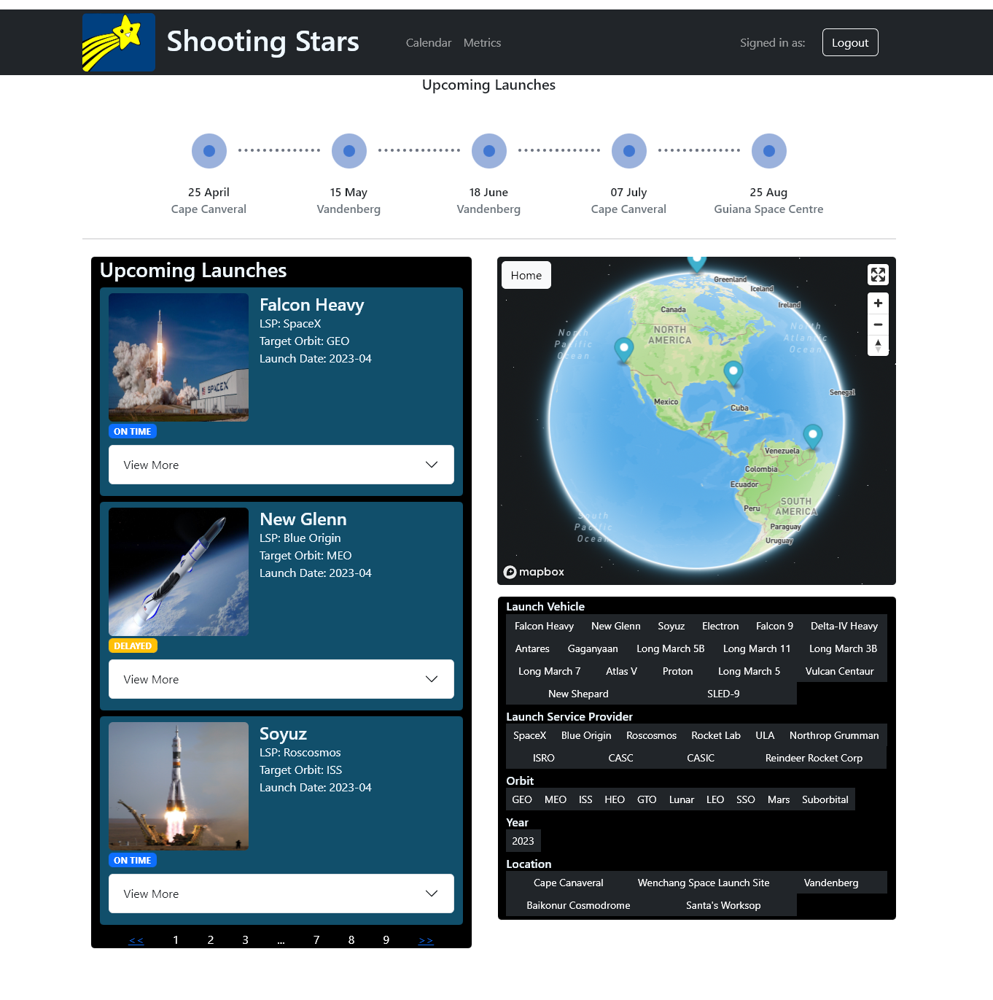
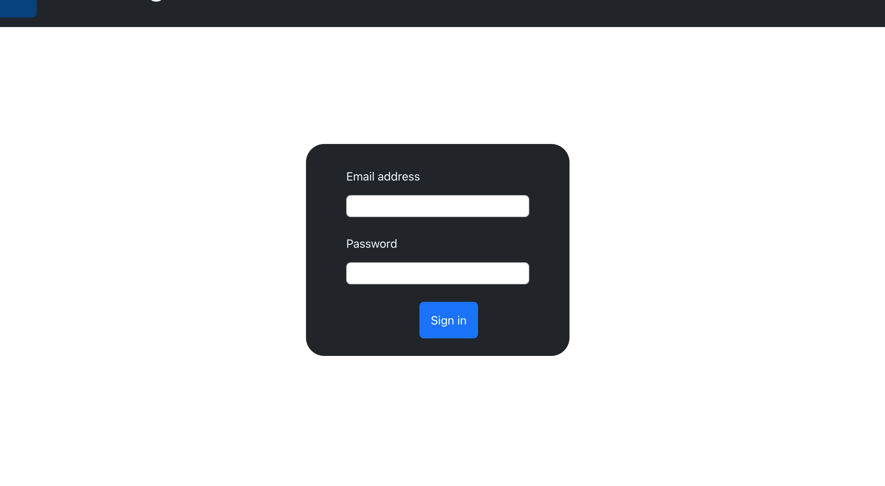
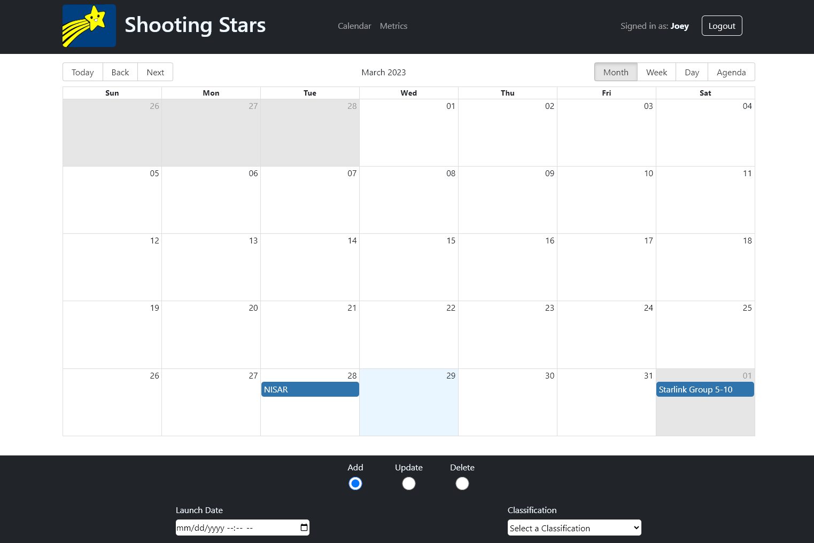
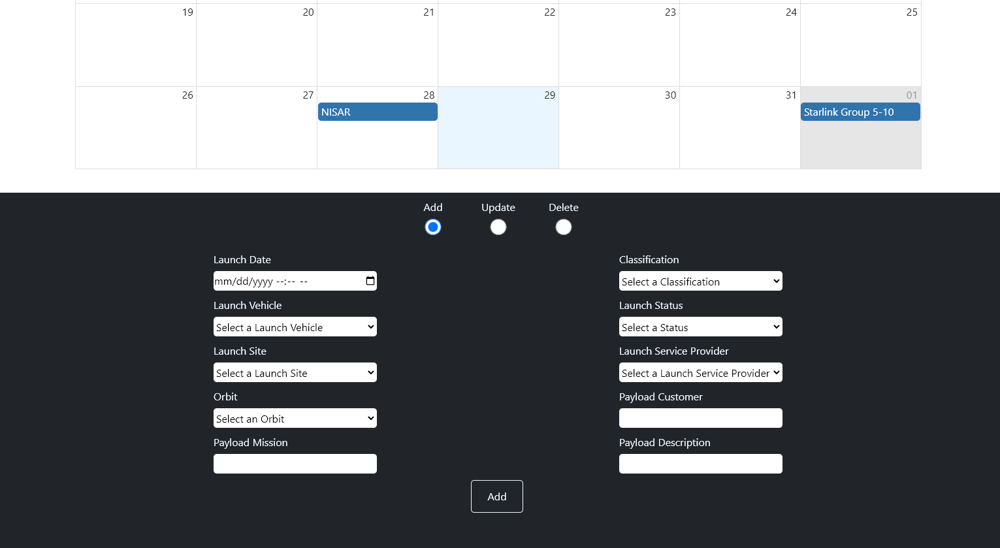
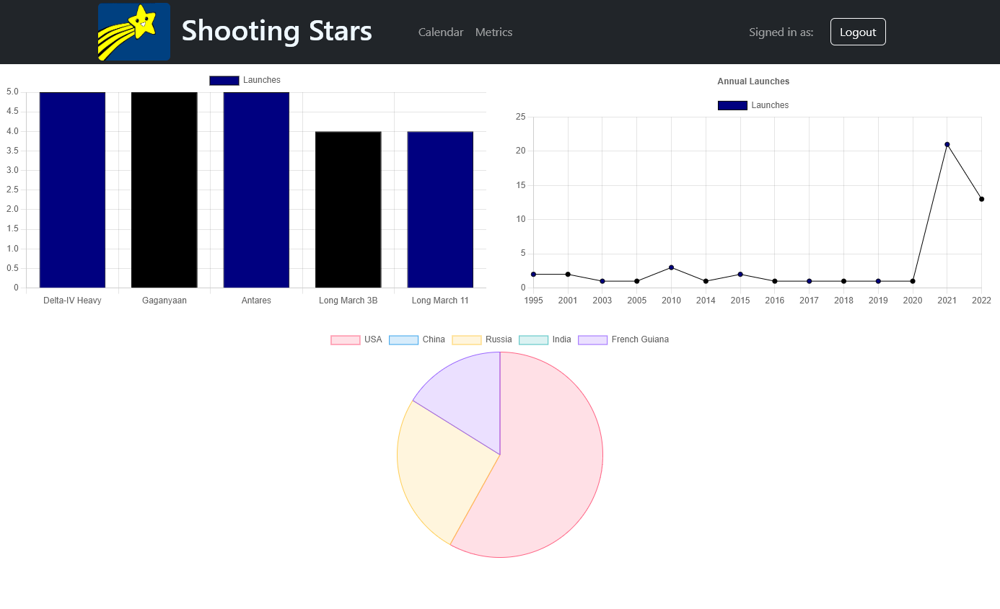

# Project 3 - Shooting Stars

Shooting Stars is a full stack web application designed to give users an all-in-one resource for viewing, creating, and updating upcoming and previous launches, payloads, launch sites, and launch vehicles.

Shooting Stars has 4 views, being the **Login**, **Home**, **Calender**, and **Metrics** pages.

# Table of Contents

- [Home](#Home)
- [Login](#Login)
- [Calendar](#Calendar)
- [Metrics](#Metrics)
- [Setup](#setup)
- [API](#api-endpoints)
- [Credits](#credits)

# Home
The home page is where the user will land upon login, it is the default page and the main functionality of the application.

Path: /

- **Features**
    - Displays a globe to view launch sites
    - Displays a launch timeline with dates for upcoming launches
    - Displays paginated cards of launches with an expandable view of the payload associated with the launch
    - Clicking on a launch card will navigate you to the corresponding launch site on the globe
    - Allows the user to filter the upcoming launches by Launch Vehicle, Launch Service Provider, Orbit, Year, and Location

    
Screenshot

    

# Login
The login page is the gate of our application. If a user visits our site and does not have an active session cookie, they will be redirected to the login where they will need to correctly enter their email and password. 

Path: /login

- **Features**
    - Protects the data from unauthorized users
    - Allows a user to sign into their personalized account which contains their clearance level and whether or not they are a site admin

    
Screenshot

    

# Calendar
The calendar page gives the user a calendar view of all launches. Users are also capable of Adding, Updating, and Deleting launches from the calendar page.

Path: /calendar

- **Features**
    - Displays a paginated calendar with launch events on their specified dates
    - Allows the user to view the calendar in month, week, day, and monthly agenda views
    - Capable of creating, deleting, and updating launches withing the CRUD form at the bottom
    - Radio buttons to select if the user is Adding, Updating, or Deleting a launch

    
Calendar Screenshot

    

    
CRUD Screenshot

    

# Metrics
The metrics page presents users with graphs related to previous launch data to look for trends.

Path: /metrics

- **Features**
    - A bar graph with the top 5 launch vehicles
    - A line chart based on launches per year
    - A pie chart with each countries launches

    
Screenshot

    

# Setup
Because our database and front end is not shared with the internet, you will need to perform this setup procedure to use the app.

This tutorial assumes your machine has Node Package Manager, Docker, and a PostgresSQL image

Note: If you are not using the default postgres username, password, or port you will need to manually configure the API/knexfile.js connection

**Back End Setup:**
- 1: Clone this repo to your machine
- 2: Setup a Postgres Docker Container running on port 5432
- 3: Add a database in Postgres named "shooting_stars"
- 4: Within the API folder, run "npm install"
- 5: To setup the tables and seed data, run "npm run reset"
- 6: To start the back end, run "npm start"

**Front End Setup:**
- 1: Navigate inside the webpage folder
- 2: Run "npm install"
- 3: Run "npm start"
- 4: To view the website, please visit "http://localhost:3000/" in your browser.

# API Endpoints

GET:
- /table/:table Returns the table specified. The following are valid tables
    - users
    - launches
    - launch_site
    - payloads
    - launch_vehicle
- /launches-join Returns launches, payloads, launch_vehicles, and launch_site all joined together

POST:
- /launches Pass a launch event into the launches table
- /payloads Pass a payload into the payloads table
- /login Send a correct email and password and the API will check if valid and return success or fail

PUT:
- /launches/:id where ID is an existing launch ID, updates a launch with the sent object
- /payloads/:id where ID is an existing payloads ID, updates a payload with the sent object

DELETE:
- /launches/:id where ID is an existing launch ID, deletes that launch from the launches table
- /payloads/:id where ID is an existing payload ID, deletes that payload from the payloads table

# Credits

**Adrian Lewis**:
- Knex Migrations
- Express Server
- Schema Design
- NavBar
- Calendar Crud Form

**Jasmine Hardin**
- Knex Migrations
- Calendar
- Home Timeline

**Joey Ocasio**
- Knex Migrations
- Express Server
- Home Launch Card
- Calendar
- Seed Data

**Khoa Nguyen**
- Knex Migrations
- Cookies
- Login Page
- Metrics

**Kyle Mersinger**
- Knex Migrations
- Seed Data
- Metrics
- Version Control
- Merge Handling
- README

**Mack Nickle**
- Knex Migrations
- Globe Functionality
- Home Filters
- 404 Page
- Seed Data
- Home Styling
